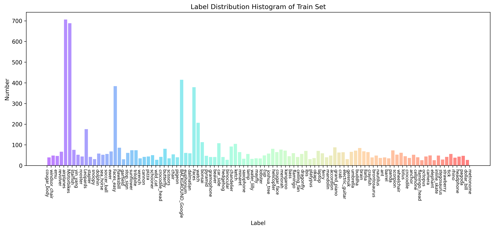
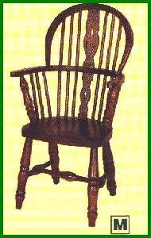
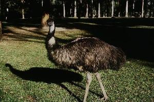
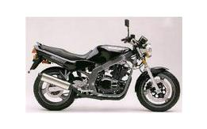

# README

> 百度菁英班结业作业Caltech101分类

使用Resnet50预训练模型来做基于Caltech数据集的图像分类。最终在测试集上准确率为0.919。

## 数据集

Caltech101数据集来源🔗 

- https://aistudio.baidu.com/datasetdetail/146107

<!-- 下面简单写一个html展示一下数据 -->

    

        
    

    

        
    

    

        
    

    

        
    

    

        
    

    

        
    

